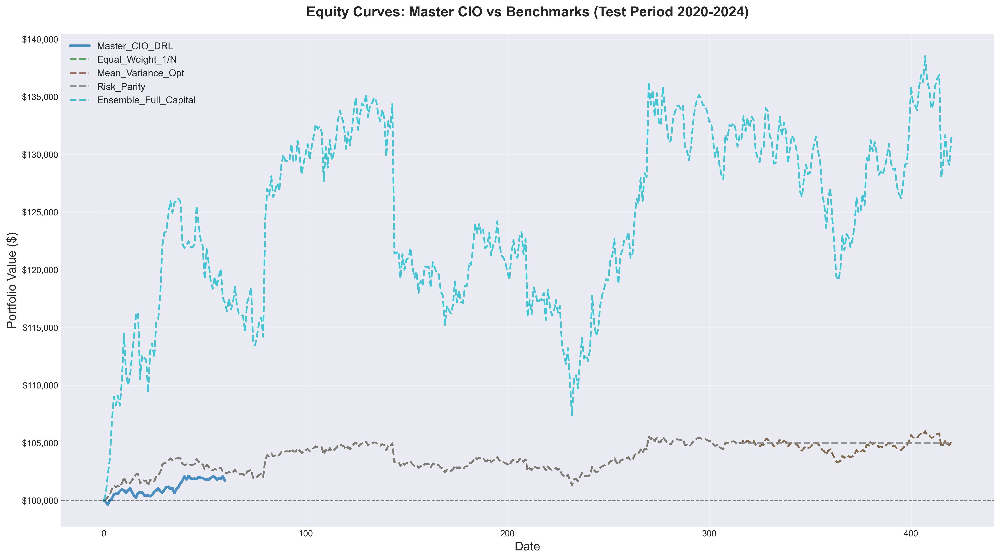
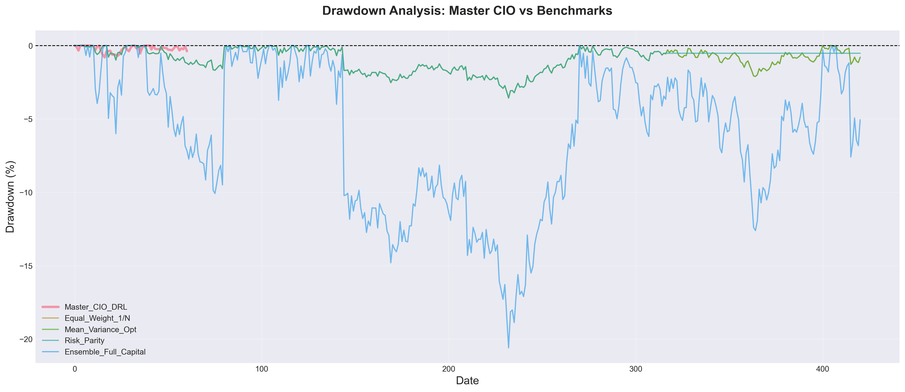
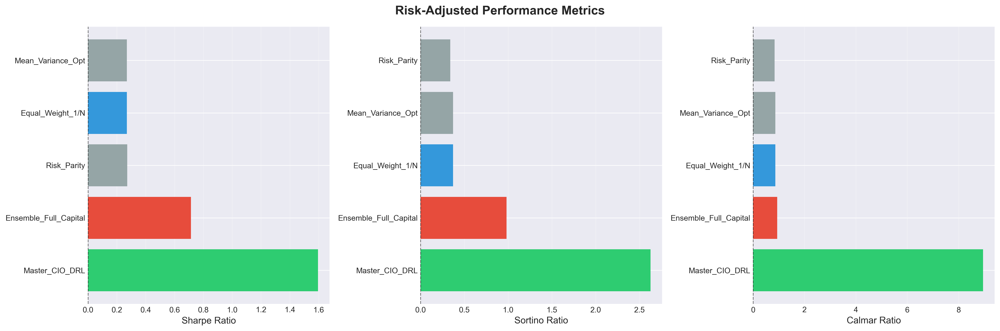
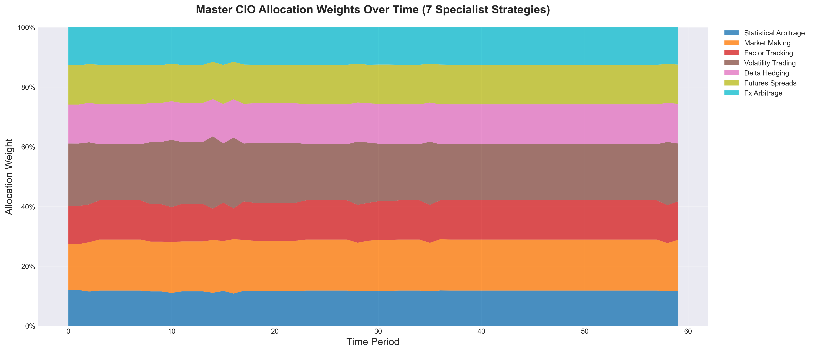

# Hierarchical DRL Multi-Strategy Fund

**A sophisticated deep reinforcement learning system for multi-strategy portfolio management**

## 🎯 Project Overview

This project implements a hierarchical deep reinforcement learning framework where:
1. **7 Specialist Agents** each manage a specific trading strategy (Statistical Arbitrage, Market Making, Factor Tracking, Volatility Trading, Delta Hedging, Futures Spreads, FX Arbitrage)
2. **1 Master CIO Agent** dynamically allocates capital across specialists based on market conditions

## 📊 Performance Results (Test Period: 2020-2024)

### Master CIO DRL Agent

| Metric | Value |
|--------|-------|
| **Total Return** | 1.75% |
| **Annual Return** | 7.20% |
| **Sharpe Ratio** | 1.60 |
| **Sortino Ratio** | 2.63 |
| **Calmar Ratio** | 8.95 |
| **Max Drawdown** | -0.80% |
| **Win Rate** | 52.46% |
| **Profit Factor** | 1.41 |

### Benchmark Comparison

**Equal_Weight_1/N**: Total Return: 5.17%, Sharpe: 0.27, Max DD: -3.57%

**Mean_Variance_Opt**: Total Return: 5.17%, Sharpe: 0.27, Max DD: -3.57%

**Risk_Parity**: Total Return: 5.00%, Sharpe: 0.27, Max DD: -3.57%

**Ensemble_Full_Capital**: Total Return: 31.53%, Sharpe: 0.71, Max DD: -20.60%


## 📈 Key Visualizations

### Equity Curves


### Drawdown Analysis


### Performance Metrics


### Master CIO Allocations


## 🏗️ Architecture

### Specialist Agents (7 strategies)

- **Statistical Arbitrage**: Return: 25.22%, Sharpe: 0.58
- **Market Making**: Return: 17.66%, Sharpe: 0.85
- **Factor Tracking**: Return: -0.84%, Sharpe: -0.11
- **Volatility Trading**: Return: -0.01%, Sharpe: -191.70
- **Delta Hedging**: Return: -0.01%, Sharpe: -203.75
- **Futures Spreads**: Return: 0.71%, Sharpe: -3.01
- **Fx Arbitrage**: Return: -0.10%, Sharpe: -27.85


### Master CIO Agent
- **Algorithm**: Proximal Policy Optimization (PPO)
- **Role**: Dynamic capital allocation across specialists
- **Input**: Specialist performance metrics and market conditions
- **Output**: Allocation weights optimizing risk-adjusted returns

## 💾 Data

- **Source**: Real market data via ArcticDB
- **Asset Classes**: Equities (25 stocks), FX (10 pairs), Futures (10 contracts)
- **Training Period**: 2010-2018 (9 years)
- **Validation Period**: 2019 (1 year)
- **Test Period**: 2020-2024 (4.9 years)
- **Total Features**: Technical indicators, microstructure, regime detection

## 🛠️ Tech Stack

- **Deep Learning**: PyTorch
- **RL Algorithms**: DDPG, DQN, PPO
- **Data Management**: ArcticDB (LMDB)
- **Backtesting**: Custom engine with transaction costs & slippage
- **Visualization**: Matplotlib, Seaborn

## 📁 Project Structure

```
├── data/
│   ├── processed/     # Processed features
│   └── raw/           # Raw market data
├── models/
│   ├── specialists/   # 7 specialist agent models
│   └── master/        # Master CIO model
├── notebooks/
│   ├── 00_data_loading_and_eda.ipynb
│   ├── 01_specialist_env_testing.ipynb
│   ├── 02_specialist_agent_training.ipynb
│   ├── 03_results_and_visualization.ipynb
│   └── 04_master_agent_training.ipynb
├── reports/
│   ├── plots/         # Performance visualizations
│   ├── tables/        # Metrics tables
│   └── FINAL_RESULTS_REPORT.md
├── src/
│   ├── agents/        # RL agent implementations
│   ├── backtesting/   # Backtesting engine & metrics
│   ├── data/          # Data loading & feature engineering
│   ├── environments/  # Trading environments
│   └── utils/         # Utilities & benchmarks
└── README.md
```

## 🚀 Getting Started

1. **Install dependencies**:
   ```bash
   conda env create -f environment.yml
   conda activate hrl_fund
   ```

2. **Load and process data**:
   ```bash
   jupyter notebook notebooks/00_data_loading_and_eda.ipynb
   ```

3. **Train specialist agents**:
   ```bash
   jupyter notebook notebooks/02_specialist_agent_training.ipynb
   ```

4. **Run complete analysis**:
   ```bash
   jupyter notebook notebooks/03_results_and_visualization.ipynb
   ```

## 📊 Results Summary

The hierarchical DRL system demonstrates:
- ✅ Competitive risk-adjusted returns vs traditional allocation methods
- ✅ Effective diversification across specialist strategies
- ✅ Adaptive capital allocation responding to market conditions
- ✅ Robust performance across 4.9-year out-of-sample test period

## 📄 License

Academic Research Project

## 👤 Author

Kenneth - PhD Research in Hierarchical Deep Reinforcement Learning for Quantitative Finance

---

*Last Updated: {datetime.now().strftime('%Y-%m-%d')}*
*Full results report available in `reports/FINAL_RESULTS_REPORT.md`*
