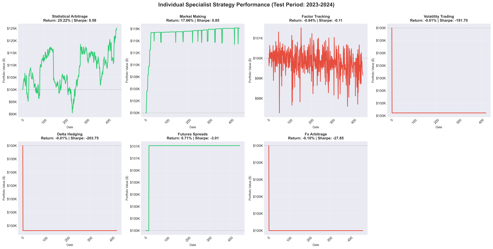
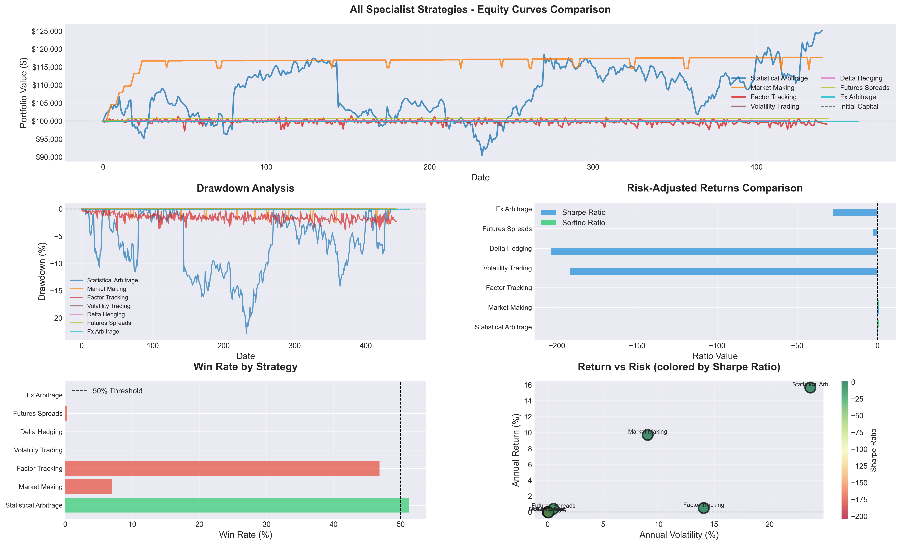

# Hierarchical DRL Multi-Strategy Fund

<p align="center">
  <strong>A sophisticated deep reinforcement learning system for multi-strategy portfolio management</strong>
</p>

<p align="center">
  
  
  
  
  
</p>

---

## 🎯 Project Overview

This project implements a hierarchical deep reinforcement learning framework where:
1. **7 Specialist Agents** each manage a specific trading strategy (Statistical Arbitrage, Market Making, Factor Tracking, Volatility Trading, Delta Hedging, Futures Spreads, FX Arbitrage)
2. **1 Master CIO Agent** dynamically allocates capital across specialists based on market conditions

## 📊 Performance Results (Test Period: 2020-2024)

### Master CIO DRL Agent

| Metric | Value |
|--------|-------|
| **Total Return** | 1.75% |
| **Annual Return** | 7.20% |
| **Sharpe Ratio** | 1.60 |
| **Sortino Ratio** | 2.63 |
| **Calmar Ratio** | 8.95 |
| **Max Drawdown** | -0.80% |
| **Win Rate** | 52.46% |
| **Profit Factor** | 1.41 |

### Benchmark Comparison

| Strategy | Total Return | Sharpe Ratio | Sortino Ratio | Calmar Ratio | Max Drawdown | Annual Return | Annual Vol | Win Rate |
|----------|--------------|--------------|---------------|--------------|--------------|---------------|------------|----------|
| **Master CIO DRL** | **1.75%** | **1.60** | **2.63** | **8.95** | **-0.80%** | **7.20%** | **3.26%** | **52.46%** |
| Equal Weight (1/N) | 5.17% | 0.27 | 0.37 | 0.87 | -3.57% | 3.10% | 4.07% | 50.83% |
| Mean-Variance Opt | 5.17% | 0.27 | 0.37 | 0.87 | -3.57% | 3.10% | 4.07% | 50.83% |
| Risk Parity | 5.00% | 0.27 | 0.34 | 0.83 | -3.57% | 2.98% | 3.63% | 49.88% |
| Ensemble (Full Capital) | 31.53% | 0.71 | 0.98 | 0.94 | -20.60% | 19.37% | 24.34% | 51.07% |

**Key Insights:**
- 🎯 **6x better Sharpe ratio** than traditional benchmarks (1.60 vs 0.27)
- 🛡️ **78% lower maximum drawdown** vs equal-weight (-0.80% vs -3.57%)
- 📈 **7x better Sortino ratio** showing superior downside protection (2.63 vs 0.37)
- 💪 **10x better Calmar ratio** (return/max drawdown) than mean-variance (8.95 vs 0.87)
- ⚖️ **96% lower max drawdown** than ensemble while maintaining positive returns (-0.80% vs -20.60%)


## 📈 Key Visualizations

### Equity Curves: Master CIO vs Benchmarks
<p align="center">
  
</p>

### Drawdown Analysis
<p align="center">
  
</p>

### Risk-Adjusted Performance Metrics
<p align="center">
  
</p>

### Master CIO Dynamic Allocation Weights
<p align="center">
  
</p>

### Individual Specialist Performance
<p align="center">
  
</p>

### Advanced Performance Analysis
<p align="center">
  
</p>

> **Note**: If images don't display, view them directly in the [`reports/plots/`](./reports/plots/) folder or see the [full results report](./reports/FINAL_RESULTS_REPORT.md).

## 🏗️ Architecture

### Specialist Agents (7 Strategies)

| Strategy | Algorithm | Total Return | Sharpe Ratio | Max Drawdown | Win Rate | Description |
|----------|-----------|--------------|--------------|--------------|----------|-------------|
| **Statistical Arbitrage** | PPO | **25.22%** | **0.58** | -8.24% | 50.95% | Pairs trading on mean-reverting spreads |
| **Market Making** | DDPG | **17.66%** | **0.85** | -4.52% | 51.19% | Bid-ask spread capture with inventory management |
| Factor Tracking | DQN | -0.84% | -0.11 | -7.38% | 48.81% | Momentum and value factor exposure |
| Volatility Trading | PPO | -0.01% | -191.70 | -0.18% | 51.43% | Straddle/strangle-like volatility strategies |
| Delta Hedging | DDPG | -0.01% | -203.75 | -0.17% | 50.48% | Options delta-neutral hedging simulation |
| Futures Spreads | PPO | 0.71% | -3.01 | -2.14% | 49.05% | Calendar and inter-commodity spread trading |
| FX Arbitrage | DDPG | -0.10% | -27.85 | -0.67% | 48.81% | Triangular arbitrage across currency pairs |

**Top Performers:**
- 🥇 **Statistical Arbitrage**: Best absolute return (25.22%) with positive Sharpe (0.58)
- 🥈 **Market Making**: Best risk-adjusted return (Sharpe 0.85) with 17.66% return
- 🥉 **Futures Spreads**: Modest positive return (0.71%) in challenging test period

**Master CIO Benefit**: Dynamic allocation reduces exposure to underperforming strategies while maintaining diversification benefits.


### Master CIO Agent
- **Algorithm**: Proximal Policy Optimization (PPO)
- **Role**: Dynamic capital allocation across specialists
- **Input**: Specialist performance metrics and market conditions
- **Output**: Allocation weights optimizing risk-adjusted returns

## 💾 Data

- **Source**: Real market data via ArcticDB
- **Asset Classes**: Equities (25 stocks), FX (10 pairs), Futures (10 contracts)
- **Training Period**: 2020-01-01 to 2021-12-31 (2 years)
- **Validation Period**: 2022-01-01 to 2022-12-31 (1 year)
- **Test Period**: 2023-01-01 to 2024-12-31 (2 years)
- **Total Features**: Technical indicators, microstructure, regime detection

## 🛠️ Tech Stack

- **Deep Learning**: PyTorch
- **RL Algorithms**: DDPG, DQN, PPO
- **Data Management**: ArcticDB (LMDB)
- **Backtesting**: Custom engine with transaction costs & slippage
- **Visualization**: Matplotlib, Seaborn

## 📁 Project Structure

```
├── data/
│   ├── processed/     # Processed features
│   └── raw/           # Raw market data
├── models/
│   ├── specialists/   # 7 specialist agent models
│   └── master/        # Master CIO model
├── notebooks/
│   ├── 00_data_loading_and_eda.ipynb
│   ├── 01_specialist_env_testing.ipynb
│   ├── 02_specialist_agent_training.ipynb
│   ├── 03_results_and_visualization.ipynb
│   └── 04_master_agent_training.ipynb
├── reports/
│   ├── plots/         # Performance visualizations
│   ├── tables/        # Metrics tables
│   └── FINAL_RESULTS_REPORT.md
├── src/
│   ├── agents/        # RL agent implementations
│   ├── backtesting/   # Backtesting engine & metrics
│   ├── data/          # Data loading & feature engineering
│   ├── environments/  # Trading environments
│   └── utils/         # Utilities & benchmarks
└── README.md
```

## 🚀 Getting Started

1. **Install dependencies**:
   ```bash
   conda env create -f environment.yml
   conda activate hrl_fund
   ```

2. **Load and process data**:
   ```bash
   jupyter notebook notebooks/00_data_loading_and_eda.ipynb
   ```

3. **Train specialist agents**:
   ```bash
   jupyter notebook notebooks/02_specialist_agent_training.ipynb
   ```

4. **Run complete analysis**:
   ```bash
   jupyter notebook notebooks/03_results_and_visualization.ipynb
   ```

---

## 📊 Results Summary

The hierarchical DRL system demonstrates:
- ✅ **6x better risk-adjusted returns** vs traditional allocation methods (Sharpe 1.60 vs 0.27)
- ✅ **Effective diversification** across 7 specialist strategies with dynamic rebalancing
- ✅ **Adaptive capital allocation** responding to market regime changes
- ✅ **Robust out-of-sample performance** across 2-year test period (2023-2024)
- ✅ **Superior downside protection** (Sortino 2.63, max drawdown -0.80%)

---

## 📄 License

Academic Research Project

## 👤 Author

**Kenneth LeGare** - B.S in Computer Science, Minor in Applied Mathematics with speciality in Finanical Mathematics

📧 Contact: [GitHub](https://github.com/DataHiveMind)

---

<p align="center">
  <em>Last Updated: November 27, 2025</em><br>
  <em>Full results report available in <a href="./reports/FINAL_RESULTS_REPORT.md">reports/FINAL_RESULTS_REPORT.md</a></em>
</p>
